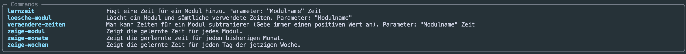
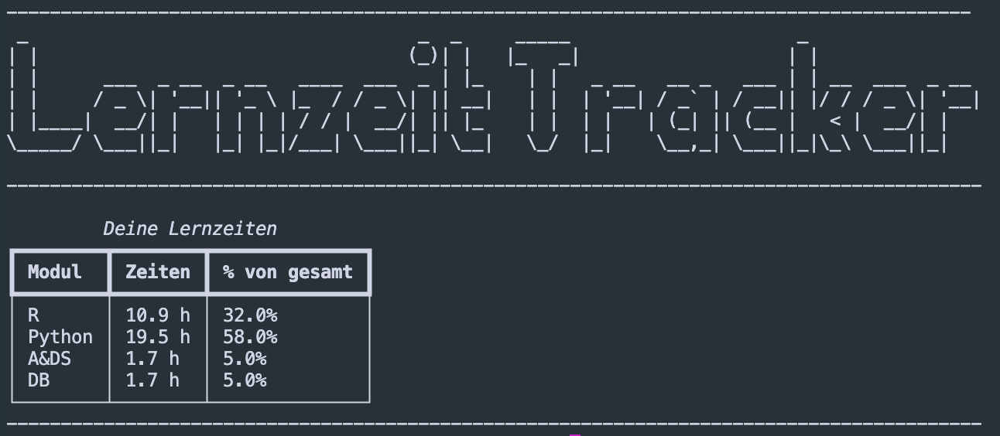
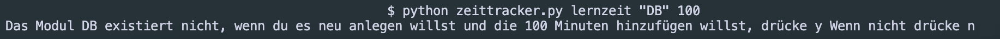
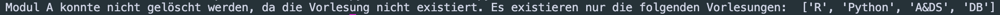
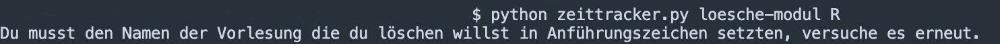

# Lernzeit-tracker

## Motivation
___
Um meinen Lernfortschritt im Studium festzuhalten tracke ich die Zeiten, die ich für Vorlesungen, Übungen und Nachbereitung aufwende.
Die meisten dieser Tracker haben viel zu viele Funktionen für meinen Bedarf und neigen eher dazu abzulenken.

Aus diesem Grund habe ich mich dazu entschieden meinen eigenen Lernzeittracker zu entwickeln. Dieser soll Kommandozeilen basiert sein und möglichst minimalistische Funktionen haben um einen somit möglichst wenig abzulenken.

Die Funktionen die geboten werden sind:

- Eintragen von Zeiten
- Darstellen der bisher aufgewandten Zeit pro Modul
- Darstellen der aufgewandten Zeit der letzten Woche
- Darstellen der aufgewandten Zeit des letzten Monats
- Hinzufügen von Modulen
- Entfernen von Modulen
- Entfernen von Zeiten

## Befehle
___
Um die Befehle ausführen zu können muss man mithilfe der Kommandozeile und dem cd Kommando in den Projektordner navigieren.

Dort führt man dann den folgenden Grundbefehl aus:

python zeittracker.py

Die Zeiten innerhalb der Befehle werden immer in Minuten angegeben.
folgende Befehle stehen zur Verfügung und können mit: python zeittracker.py --help angezeigt werden:

Um 15 Minuten zu dem Modul Datenbanken hinzuzufügen, würde man somit den folgenden
Befehl ausführen: python zeittracker.py lernzeit "Datenbanken" 15

Der Output des zeige-modul Befehl würde, z.B. wie folgt aussehen:

## Architektur
___
Die verwendeten Bibiliotheken und Programmiersprachen, sowie deren Version lassen
sich in der [requirements.txt](requirements.txt) Datei nachlesen.

Um das Projekt möglichst simpel zu halten, habe ich lediglich folgendes verwendet:

- Python
- MySQL

Die vom Nutzer ausführbaren Funktionen greifen jeweils auf Methoden zu, welche
SQL-Queries ausführen und die benötigten Daten in die Datenbank im Backend schreiben
oder auslesen.

Einige der Methoden können spezifische Fehler aufwerfen, welche ich in  
Error Klassen definiert habe. Diese lassen sich [hier](Skript/Fehler.py) finden.
Hierüber stelle ich sicher, dass Nutzer korrekte Werte eingeben.
Wenn ein Nutzer z. B. ein Modul löschen will, welches nicht exisiert, wird ein
VorlesungNotFound Error geraised.

## Benutzer Rückfragen und Fehlermeldungen
___

### Hinzufügen einer Zeit für eine Vorlesung, die noch nicht existiert:

### Löschen eines Moduls welches nicht existiert:

### Eingabe eines falschen Datentyps in eine Funktion:

## Eigenimplementierung
___
Um das Programm bei sich ausführen zu können benötigt man folgendes:

Sämtliche Programmiersprachen und Bibiliotheken aus der [requirements.txt](requirements.txt) Datei.

Eine MySQL Datenbank mit dem Namen: Lernzeit_app
Zusätzlich müssen die eigenen MySQL Zugangsdaten in die [secrets.py](Skript/secrets.py) Datei
eingetragen werden.

Eine Unix-Kommando fähige Kommandozeile um Funktionen auszuführen.

Sobald die MySQL Datenbank erstellt wurde und die Zugangsdaten in der Secrets
Datei hinterlegt wurden, kann man das Programm nutzen. Eine Tabelle wird in der
Datenbank mit der ersten benutzung automatisch erstellt.

## Weiterentwicklung
___
Die von mir angedachten Funktionen sind bereits gegeben.
Allerdings werde ich das Projekt noch mit einer Model-View-Controller Architektur
aufbauen. Falls jemand Ideen für eine Weiterentwicklung hat, gerne einen Kommentar
hinterlassen oder einen Pull-Request eröffnen.

Die Sql-Statements sind noch Hardkodiert, was sie anfällig für SQL Injections macht.
